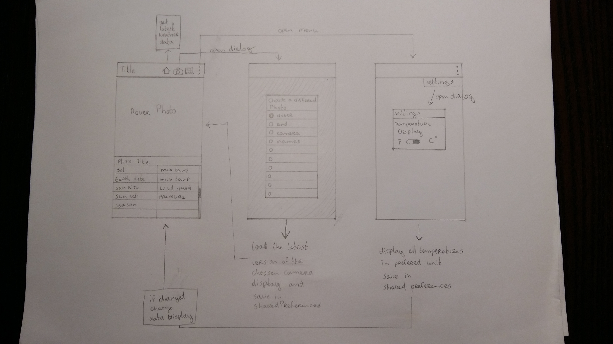
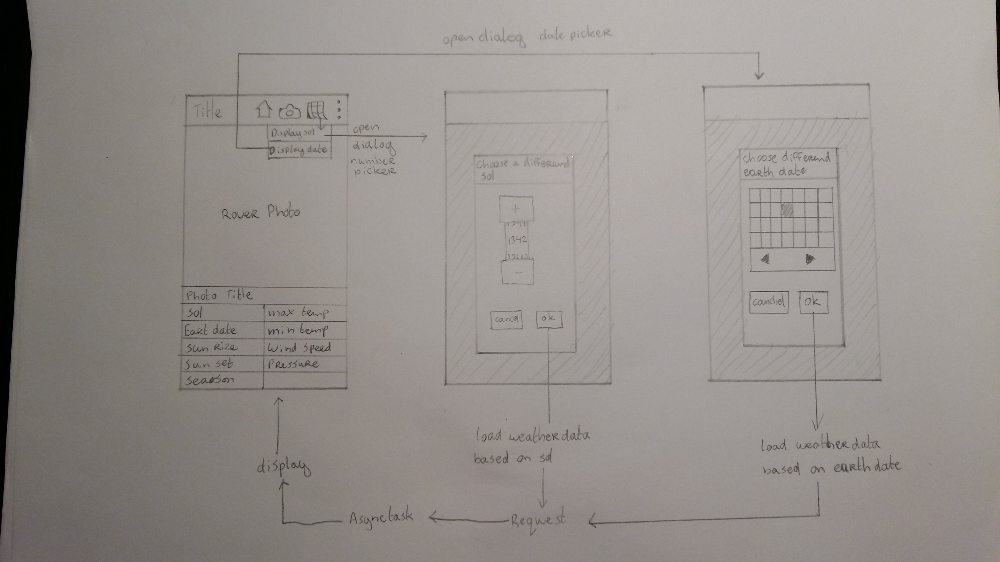
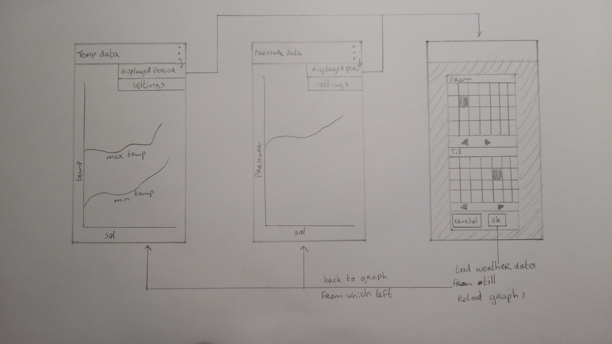
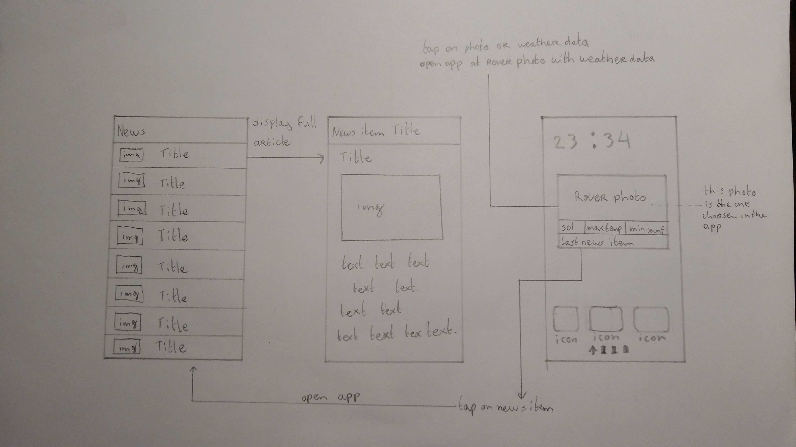

# Design Document

###### Nadeche Studer

### Mars Weather Explorer

##### UML diagram application overview

##### UI Sketches
Swipe navigation between homescreen, graphs and news items list.
###### Sketch homescreen with actionbar function

###### Sketch chose a different date to display data from

###### Sketch display of graphs and choose a difereld timespan to display

###### sketch display of news items list and news article and widget

##### API's and plugins / libraries

The app will use three different APIs as data sources. These APIs all return a JSON object which can be put in Java model classes to work with the data and display it.

- The {MAAS} API will be used for all weather data. [marsweather.ingenology](http://marsweather.ingenology.com/)

- The NASA Mars Photos API will be used to get all rover photos. [Mars Photos](https://api.nasa.gov/api.html#MarsPhotos)

- The Twitter API will be used to collect the latest tweets from Curiosity. [Twitter API](https://dev.twitter.com/rest/public) & [Curiosity Twitter Account](https://twitter.com/marscuriosity)

To display the graphs in the app displaying the past weather data the libary [GRAPH VIEW](http://www.android-graphview.org/) will be used. This libary can handle realtime data, so it should be able to handle a flexible x axis. This way the user can tell how much of the past weather data he wants to view.

The Twitter news feed is nice and simple to implement with the Twitter API, but the news on the [NASA Curiosity site](http://mars.nasa.gov/msl/mission/mars-rover-curiosity-mission-updates/) has more interesting content. However there is no API to collect these news articles. To bring these stories in the app the site will have to be scraped. [JSOUP](https://jsoup.org/) is an open java libary to do this, but it is unsure if it can be implemented within an Android app. When all other features are implemented if there is enough time this can be an option to implement. However if there is not enough time the Twitter feed will be just fine.