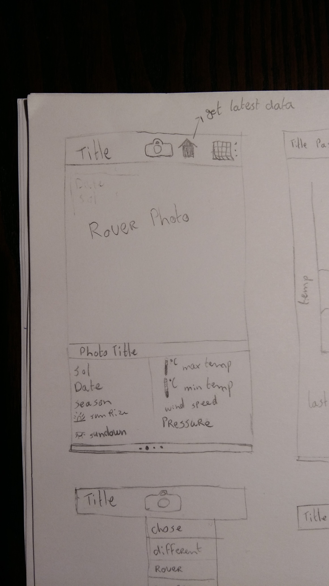
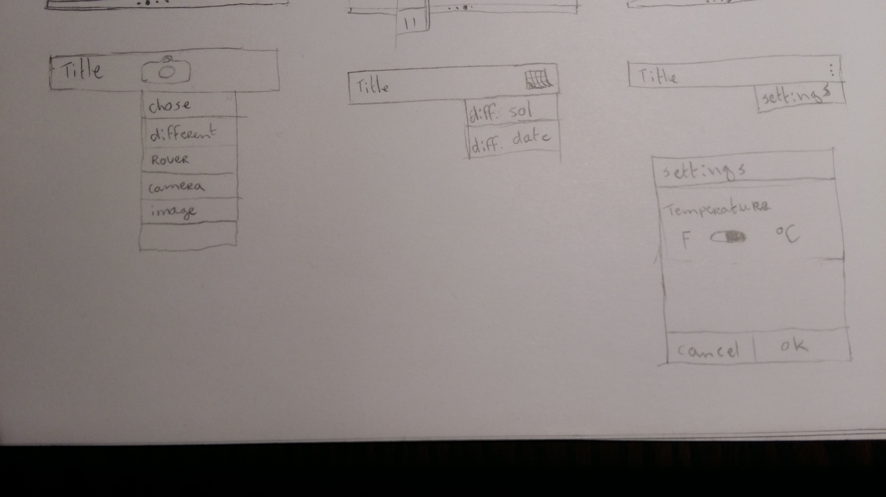
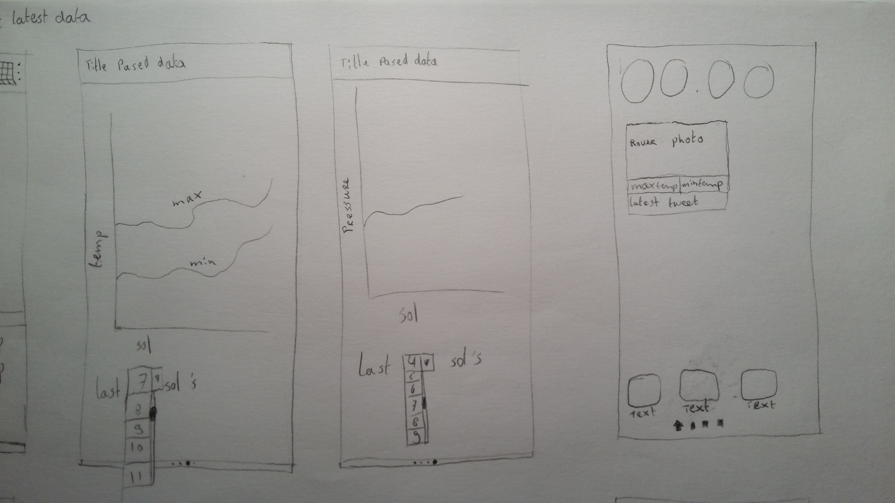
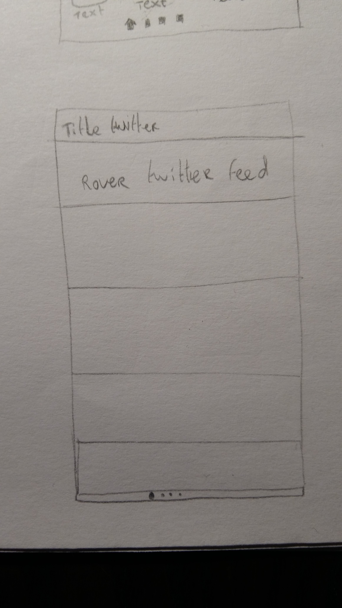

# Mars Weather Explorer
###### Programming Project - Minor programming University of Amsterdam.
##### Nadeche Studer

### Project Proposal

- Application goals
- Problem definition
- Feature overview
- User Interface sketch
- Data sets and API sources
- Possible technical problems and solutions
- Review existing mars weather applications

### Application goals
The goals of this application are:
- To provide up-to-date weather information from Mars.
- To give an overview of past weather information from Mars.
- To provide a light newsfeed from Mars.
- To give the user the ability to view Mars' surface together with a Mars rover.

All these goals should give the user a part of the excitement of exploring Mars. 

### Problem definition
Humans are naturally curious, in ancient times we have sent brave men to distant parts of our planet to tell us what it was like over there. In modern times we sent brave rover bots to distant planets to tell us what it is like over there. We fantasize about going to Mars and start a human colony over there. But what about the weather? Let those rover bots tell us first what it is like over there before we make any decision about moving there. 
Curiosity sends back weather data to earth nearly every Martian day and images of its environment every Martian day. Although NASA makes this data publicly available, you have to look for it daily. So an app that automatically collects the latest data for you would be a good solution. This way it can feel like you are in direct contact with a distant explorer, experiencing a part of the excitement human explores must have had when they found an unexplored piece of the earth.

The weather is a classic small talk topic. But the next time you are in need of a conversation topic, you can discuss the weather on Mars.
### Feature overview
- The display of the latest weather data from Mars. (MVP)
	- The user can choose to display the temperature in degrees Celsius or in Fahrenheit. (MVP)
	- The user can search for past weather data by Martian solar days and by earth dates. (MVP)
- The display of a latest image sent back by one of the Mars rovers, from one of its cameras. (MVP)
	- The user can choose to display a different image from one of the other rovers or cameras. (MVP)
- The display of certain past weather data like temperature and atmosphere pressure, in a visual way, a graph. 
	- The user can choose how many Martian solar days are visualized. 
- The display of the latest tweets from Curiosity with additional news and updates.
- The user can choose to display a widget with the latest minimum and maximum temperature the latest image, chosen in the app from which camera, and the latest tweet. (MVP)

These features are also the separate parts of the app. Together they give the user an overview of what Curiosity encounters on Mars. The up to date data makes sure the user feels very connected to what is happening now on Mars. 
### User Interface sketch
###### Home Screen

###### Actionbar functionality

###### Past data visualization and widget

###### Twitter latest news feed

### Data sets and API sources
The app will use three different API's as data sources. These API's all return a JSON object which can be put in java model classes to work with the data and display it.
- The {MAAS} API will be used for all weather data. [marsweather.ingenology](http://marsweather.ingenology.com/)
- The NASA Mars Photos API will be used to get all rover photos. [Mars Photos](https://api.nasa.gov/api.html#MarsPhotos)
- The Twitter API will be used to collect the latest tweets from Curiosity. [Twitter API](https://dev.twitter.com/rest/public) & [Curiosity Twitter Account](https://twitter.com/marscuriosity)

### Possible technical problems and solutions
- The images from the Mars Photo API could be too high in resolution, this can cause high data usage for the user and long waits for an image to load. There is maybe a way to pre compress the images.
- The images from the Mars Photo API have probably all different dimensions, this can become ugly in a static UI. Empty space around the image can occur. It may be possible to make the UI flexible, so it organizes itself around the image.
- I don't know if there is a special library to make graphs. If there is one, I need to learn to use it. If not I may have to build one.

### Review existing Mars weather applications
Within Google Play there are a few Mars weather apps. I will discuss the four most popular:
- REMS Mars Weather
	This is a Spanish language based app which has a very poor user interface. It does display historical data in a graph, but does not display any images from the rover.
- Mars Weather Widget
	This is purely a widget with a current rover photo and a minimum and maximum temperature, nothing more. So this is very limited.
- Mars Weather App
	This does display the weather data and a rover photo, but again the user interface is very poor and ugly. It also does not display any historical data.
- Space Weather
	This app is very comprehensive. It displays the weather data from Mars and phases of the moon and solar wind data and sunspots. Although the user interface is very pretty, it does not have the option to browse Mars rover images nor does it have any graphs of historical data.

None of these apps displays any rover news from Mars.
