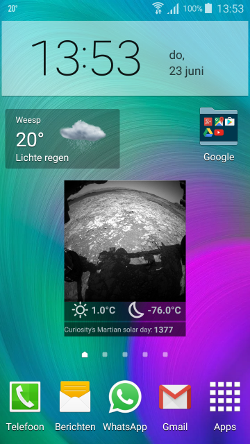
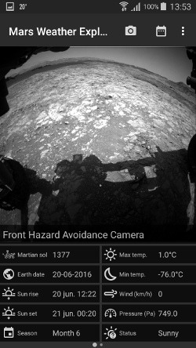
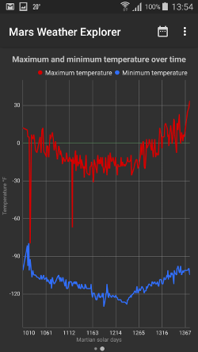
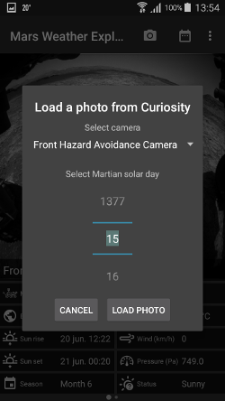

# Mars Weather Explorer
###### Programming Project - Minor programming University of Amsterdam.

**Widget**

**Weather data screen**

**Graph data screen**

**Example of how the user can interact with the data**

Humans are naturally curious, in ancient times we have sent brave men to distant parts of our planet to tell us what it was like over there. In modern times we sent brave rover bots to distant planets to tell us what it is like over there. We fantasize about going to Mars and start a human colony over there. But what about the weather? Let those rover bots tell us first what it is like over there before we make any decision about moving there.
Curiosity sends back weather data to earth nearly every Martian day and images of its environment every Martian day. Although NASA makes this data publicly available, you have to look for daily updates yourself. This app automatically collects the latest data and provides an interface throuth which the data is easaly browsable. This way you can feel like you are in direct contact with a distant explorer, experiencing a part of the excitement human explores must have had when they found an unexplored piece of the earth.
The weather is a classic small talk topic. But the next time you are in need of a conversation topic, you can discuss the weather on Mars.

This app is created by **Nadeche Studer**
Copyright © 2016 *Nadeche Studer* No Rights Reserved
Released under MIT licence (for details see LICENSE.md)

###### Scources and materials
**Data provided by:**
- The {MAAS} API for all weather data. [Marsweather.ingenology](http://marsweather.ingenology.com/)

- The NASA Mars Photos API for all rover photos. [Mars Photos](https://api.nasa.gov/api.html#MarsPhotos)

**Used icons thanks to:**
- [Material Icons](https://design.google.com/icons/)
- Simple weather icons by Daniel Vierich

**Used Libraries:**
All released under the [Apache v2.0 licence](http://www.apache.org/licenses/LICENSE-2.0)
- For graph display: [MPAndroidChart](https://github.com/PhilJay/MPAndroidChart)
- For dotNavigation: [Sliding intro screen](https://github.com/MatthewTamlin/SlidingIntroScreen)
