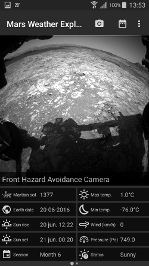

# Process report
###### Nadeche Studer

Curiosity sends back weather data to earth nearly every Martian day and images of its environment every Martian day. Although NASA makes this data publicly available, you have to look for daily updates yourself. This app automatically collects the latest data and provides an interface throuth which the data is easaly browsable. This way you can feel like you are in direct contact with a distant explorer, experiencing a part of the excitement human explores must have had when they found an unexplored piece of the earth.
###### Technical Design

